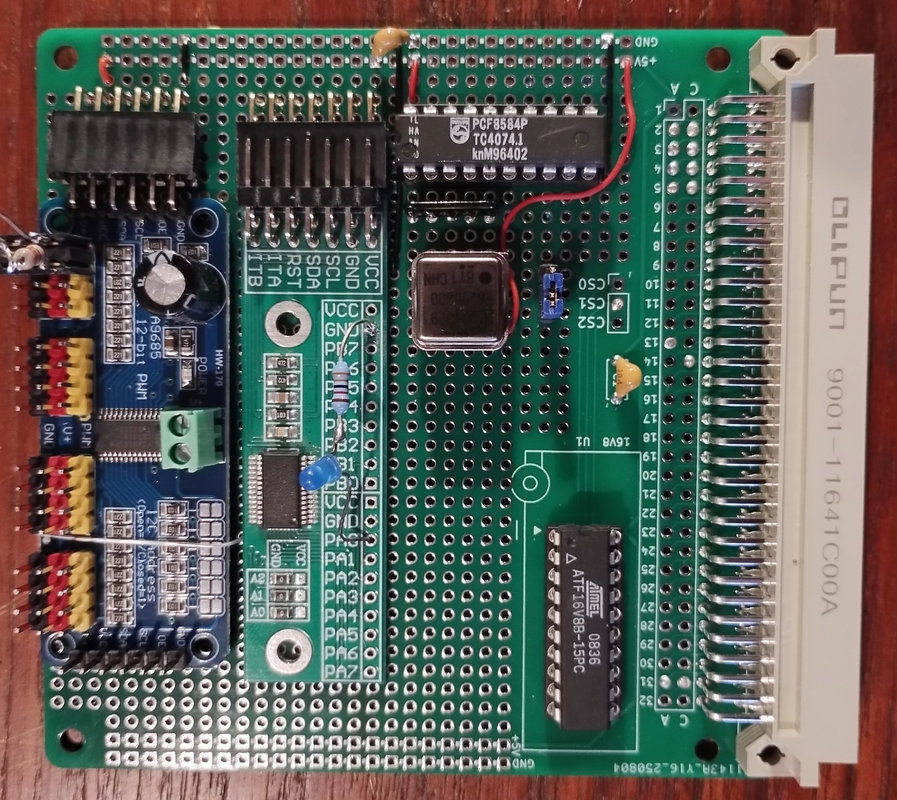
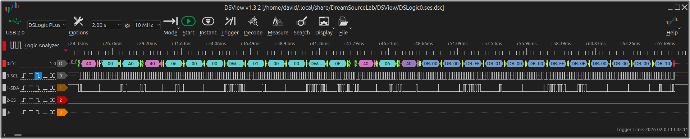
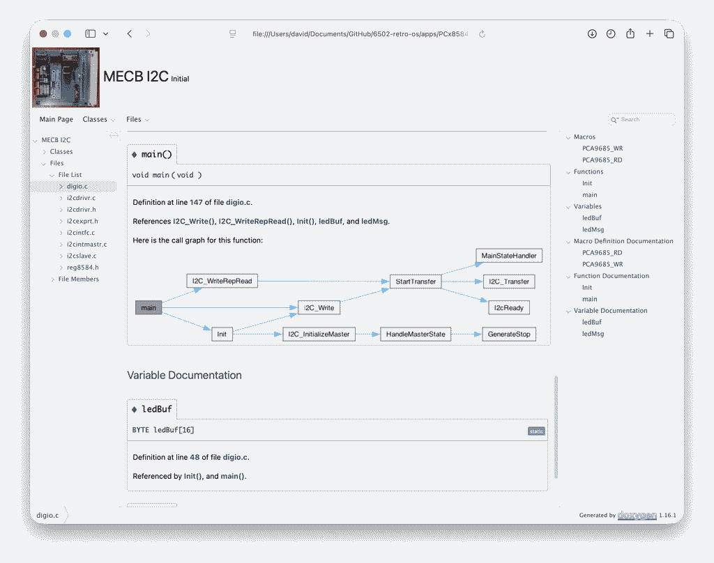
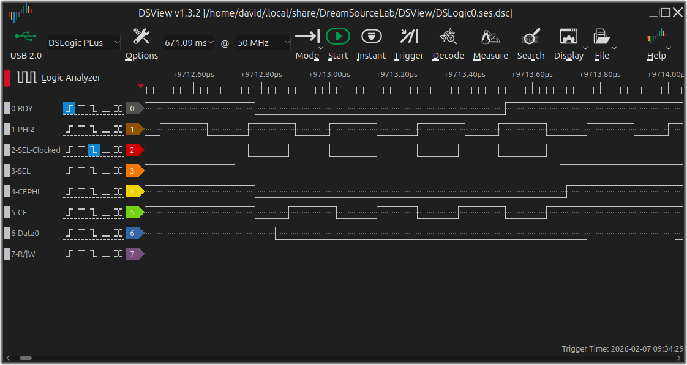
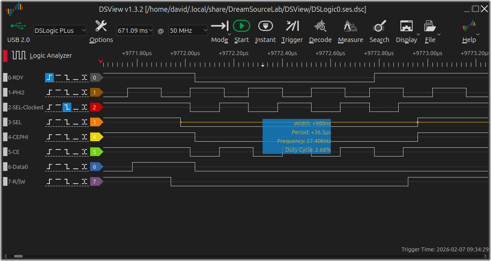
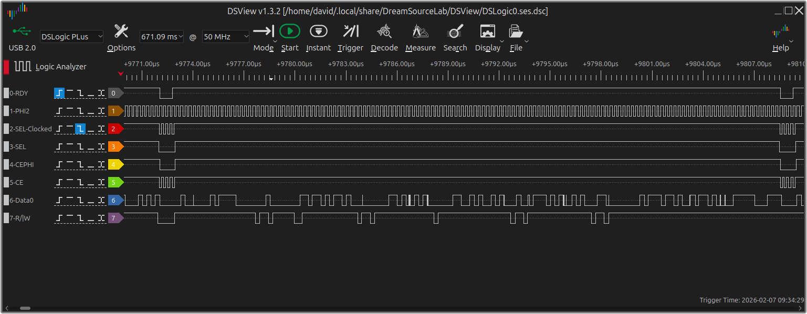

# MECB_I2C
MECB Prototype I2C tests

Ive been experimenting with I2C using both bit bang on VIA digital I/O ports and also with a Philips P8584 I2C driver chip.
The simple bit bang driver is written in assembler adapted from source found here: https://github.com/hauerdie/6502_i2c/
(it would probably work just as well with 6821 PIA with port regiser address changes)

The P8584 driver is taken from the Philips application note and made to work with CC65 under 6502-retro-os.
The prototype board:



For testing I have used a DS1302 RTC module with onboard eeprom, and a couple of breakout boards. And digital i/o modules MCP23017 and PCA9685. The bitbang software includes a port scanner which was a useful stepping stone to getting the software working - although it seems to have had its own problems.

Here is the output from the scan program - active devices are shown as -- in place of the address.

```
A>i2cscan 68
 --
     0  1  2  3  4  5  6  7  8  9  a  b  c  d  e  f
00:          03 04 05 06 07 08 09 0A 0B 0C 0D 0E 0F
10: 10 11 12 13 14 15 16 17 18 19 1A 1B 1C 1D 1E 1F
20: -- 21 22 23 24 25 26 27 28 29 2A 2B 2C 2D 2E 2F
30: 30 31 32 33 34 35 36 37 38 39 3A 3B 3C 3D 3E 3F
40: -- 41 42 43 44 45 46 47 48 49 4A 4B 4C 4D 4E 4F
50: 50 51 52 53 54 55 56 -- 58 59 5A 5B 5C 5D 5E 5F
60: 60 61 62 63 64 65 66 67 -- 69 6A 6B 6C 6D 6E 6F
70: -- 71 72 73 74 75 76 77                        
A>
```

A simple program to read the clock was supplied with the driver
a trace of bus activity when reading the DS1302 is shown here:



The other project using the Philips drive IC has a driver written in C, retro-os fully supports C applications with an IO library. For testing I wrote a few lines to output to the PCA9685 to drive a LED.

{html: width=50%, latex: width=5cm}

To help understanding the data flow in the driver I added a Doxygen to the project, I like this and find the call graphs really useful. Here is a sample:



Unfortunately the P8584 driver IC is not rated for cpu bus speeds above 1Mhz, there is a way to extend the access time using the cpu RDY line and when I have some suitable logic ICs to implement this I'll give it a try. In the meantime I have to swap the 4MHz clock for a 1Mhz clock.

## 4MHz operation with PLD RDY extender

I now have a PLD programmed to extend the bs cycle by pulling the ready line low for four clock cyclles allowing the PCF8584 to work on a 4MHz 6502

A benefit of this is that the system now works at the full I2C bus speed available on this chip - 90kHz




The PLD code was mainly written by the Google AI robot, some minot edits were made afterwards. I need to investigate some minor problems but the code given here is working as expected.

[16v8 PLD Code](./documents/NAME.PLD) 
A detail showing the PLD gray code counter outputs
[16v8 PLD detail](./images/i2c-rdy-sm.png)

A screenshot from the logic analyser showing the extended bus cycles when the I2C chip is selected

